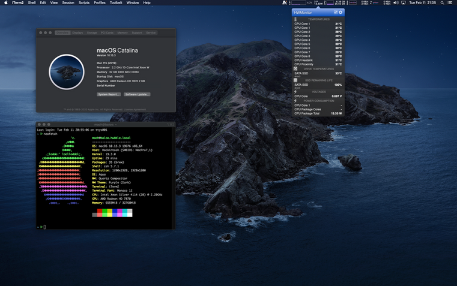

# Approach to Making Compelling Videos !

### Step 1: (Very) Minimalistic Equiptment Requirements

-   Lighting: softbox
-   Microphone: lav mic etc
-   Backdrop with correct lighting. This should add mood and set the video&rsquo;s tone

### Step 2: Writing a script: Essential Parts and Content

-   **Content is king.** In my opinion, this is the most important step. Scripts should be mostly just outlines and the videos *messege*  or story should be authentic/internalized enough so the material flows outward and it takes flight

### Step 3: Approach and Mindset &#x2013; Letting go of perfection

Just create. Good ideas are simple and self-propel.

### Step 4: Editing it all together with Effective Software

-   **Video Software on Linux** Unfortunately there is no good video editing software for linux. The best bet here seems to be [Davinci Resolve for linux](https://www.blackmagicdesign.com/products/davinciresolve). This software can be installed on kde/ubuntu with a open source installer &#x2013; since Davinci provides for (I think) redhat linux OS only (link). However The linux version of this was lacking capability to do basic functions like adding a voiceover track (see [this forum](https://forum.blackmagicdesign.com/viewtopic.php?f=32&t=92281)). Such a missing basic functionality means this is not a good option, as Resolve&rsquo;s linux build does not seem to be up to par to the mac&rsquo;s, and no other linux video editing software stands out as a possibility. Hence, for video editing, mac still seems to be the best bet.
    
    -   **Hackintosh Idea.** Buying a beefy mac with video editing specs is prohibitivly expensive, so I would like to explore, is possible to install the mac OS onto certain computers? eg [OS X Cataline on this Dell](https://www.reddit.com/r/hackintosh/comments/f2t7wb/catalina_on_my_dell_precision_7820_with_opencore/)
    
    

-   **Video Editing Skills** &#x2013; List.
-   **learning from others**. While watching a top youtube creator, it should be useful to script out what they are saying, and how that dialogue meshes the camera action. By putting that in a two-column list, one can see the action-dialogue coordination, like in the table below. How those two elements interact can add to the video&rsquo;s cohesiveness. They can either cohere or clash.
    
    I think really effective youtubers learn each other frequently this way &#x2013; we have instinct for what&rsquo;s good, then getting down to bare bones as to why and how the creator achieved that.
    
    -   Something like this:
        
        <table border="2" cellspacing="0" cellpadding="6" rules="groups" frame="hsides">
        
        
        <colgroup>
        <col  class="org-left" />
        
        <col  class="org-left" />
        </colgroup>
        <thead>
        <tr>
        <th scope="col" class="org-left">Action</th>
        <th scope="col" class="org-left">Dialogue</th>
        </tr>
        </thead>
        
        <tbody>
        <tr>
        <td class="org-left">Fade in screen recording from Black</td>
        <td class="org-left">Hello and welcome. Today we will be covering some useful skill in emacs-calc Mode</td>
        </tr>
        </tbody>
        
        <tbody>
        <tr>
        <td class="org-left">Show a title slide with tutorial agenda items in a bullet list</td>
        <td class="org-left">In this Video we will be showing basics of reverse polish calculator notation  which is tricky at first  , cover basic ways to access calc&rsquo;s most useful functions, graph a function, and last show how to integrate emacs-calc with other area of emacs to increase workflow, such as with org-mode.</td>
        </tr>
        </tbody>
        
        <tbody>
        <tr>
        <td class="org-left">Fade talking head</td>
        <td class="org-left">But thats not all !</td>
        </tr>
        </tbody>
        </table>

